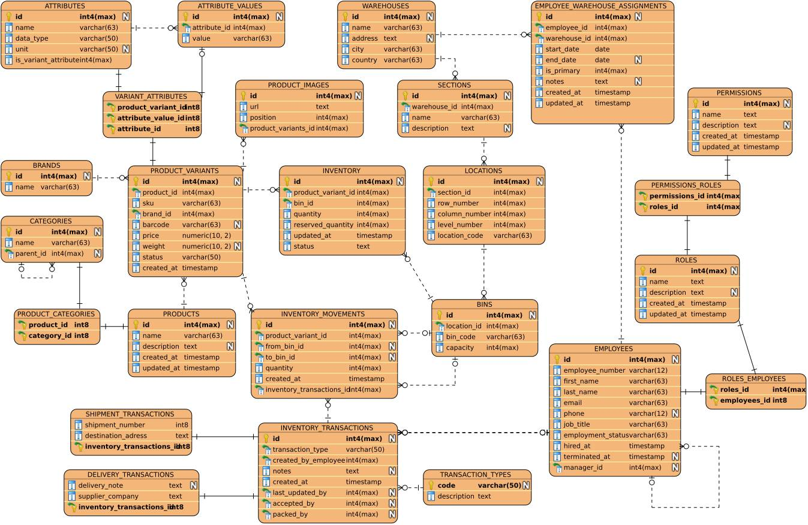

# Warehouse Inventory Management System

SQL-based inventory tracking for an advanced database course. Models hierarchical warehouse storage, stock movements, and full transaction history on PostgreSQL.

## Key Features
- Products catalog with metadata (category, manufacturer, supplier)
- Hierarchical location model: warehouse → section → location → bin
- Stock transfers (internal/cross-warehouse) and external imports/exports
- Data integrity enforced through constraints, checks, and referential keys
- Realistic data volumes generated entirely with SQL – recursive CTEs, `generate_series`, and cross joins produce multiple tables with **millions of rows** to simulate a production environment
- Complex views, custom PL/pgSQL functions, and triggers
- Query performance analysis and index-based optimization

## Tech
- PostgreSQL (local and FINKI faculty server)
- Pure SQL and PL/pgSQL
- Git for version control

## Data Generation
All sample data is created using parameterized SQL scripts. Core transactional tables (inventory, transactions, movements) contain several million rows, while supporting tables (products, locations, product variants) are populated to realistic scales. The generation logic relies on built‑in PostgreSQL features (`generate_series`, recursive CTEs, random functions, cross joins) to produce coherent, voluminous datasets without external tools.

## Usage
Works both on a local PostgreSQL instance and on the faculty’s FINKI server – just point the DDL and data scripts to the target host. The repository is updated as each development phase is completed and approved.

## Relational Model

The following diagram illustrates the relational schema of the Warehouse Inventory Management System, including tables, attributes, and relationships:

---

*Demonstrates practical SQL skills: schema design, large‑scale data generation, query optimization, and procedural database programming.*
